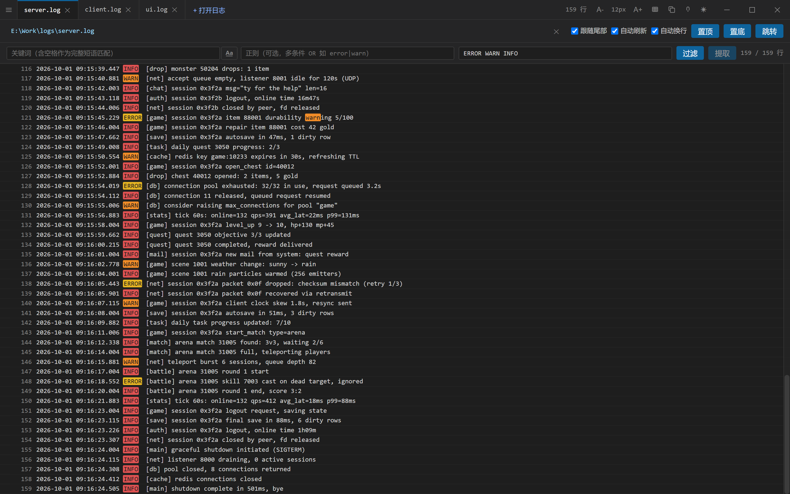

# LogLens

A fast log viewer for Windows, built with **Tauri 2 + React + TanStack Virtual**.

Designed for large log files: follow them in real time and browse anywhere without loading everything.

## Features

- **Live tail** — incremental reads from the end of the file; survives truncation, rotation, and full rewrites.
- **Filtering** — keyword and regex as two mutually exclusive modes sharing one input box; keyword is the default.
- **Find in content** — a VSCode-style floating widget (`Ctrl+F`); forward search, match-case and whole-word, Enter to step through hits. Its scope follows the filter.
- **Sparse virtual scrolling** — the scrollbar maps the whole file; unloaded regions load on demand.
- **Line index** — a sampled byte-offset index makes line lookups O(sample gap) instead of a full scan.
- **Session restore** — reopens the previous tabs, and reuses the last window size.
- **Extras** — multi-tab, jump-to-line, keyword highlighting, copy-view, recent files, bilingual UI (中文 / English), custom borderless title bar.
- **Config-table viewer** — switch a tab to a GM10 `client_cfg` (MemoryPack) table view via the icon button at the left of its toolbar; columns size themselves to their content. Format spec: [docs/client_cfg_bin_format.md](docs/client_cfg_bin_format.md).
- **Markdown preview** — `.md` / `.markdown` files open straight into a rendered document view (GFM tables, task lists, footnotes, syntax-highlighted code, LaTeX math via KaTeX). A collapsible outline sits on the left, the body width is adjustable in 1% steps, `Ctrl+F` finds in the rendered page and `Ctrl+E` flips between preview and source. Local images load through the dynamically scoped asset protocol and fall back to a path chip when they cannot be loaded; remote ones stay chips on purpose. Details & limits: [docs/markdown-view.md](docs/markdown-view.md).
- **Body pages** — the content area is a small page framework (text / table / markdown / file-missing / open-error). A tab whose file was deleted or moved (recent files, session restore) shows a one-line “File not found: <path>” notice instead of a blank body; reopening the same path re-checks it. Guide: [docs/body-views.md](docs/body-views.md).
- **Settings & font customization** — the gear at the right of the toolbar (or “Settings…” in the app menu) opens a modal settings page: theme, UI language, body font size, and **separate non-CJK / CJK fonts**. The dropdown lists the machine's **real font set** (enumerated from DirectWrite in the Rust backend — ~270 families on a typical Windows box, searchable by English or localized name), grouped into monospace / CJK-covering / other using facts the fonts themselves declare. The two families are stacked per character (`Consolas` for Latin, your Chinese face for Han), so mixed text uses each family for its own glyphs, and the choice applies to every view at once — log rows, the table view, Markdown preview and its source — plus the UI itself. The modal previews the three views live, and a proportional face warns that column alignment becomes an estimate. Guide: [docs/settings.md](docs/settings.md).

## Screenshot



## Requirements

- Windows 10 1809+ (WebView2)
- Rust 1.97 (pinned in `src-tauri/rust-toolchain.toml`; 1.98+ crashes on the `windows` crate)
- Node.js ≥ 18 + pnpm

## Build & run

```powershell
make loglens            # run the release exe (no HTTP server, frontend embedded)
make loglens-build      # rebuild release (--no-bundle)
make loglens-package    # build the NSIS installer
make loglens-dev        # dev mode (Vite dev server on 5173)
cd src-tauri && cargo test --lib   # backend tests (incl. DirectWrite system-font enumeration)
node --test tools/verify-body-views.test.mjs   # body-page rules (no browser needed)
node --test tools/verify-markdown.test.mjs     # markdown pipeline rules (no browser needed)
node --test tools/verify-settings.test.mjs     # settings / font-stack rules + CSS consistency
node --test tools/verify-md-sample.test.mjs    # markdown sample doc (repro/md-sample.md)
node --test tools/verify-feature-test.test.mjs # feature-test docs (repro/md-feature-test*.md)
node tools/e2e-file-missing.mjs --launch       # browser E2E (run `pnpm run dev` first)
node tools/e2e-markdown.mjs --launch           # markdown-view E2E (sanitizing/math/find/links)
node tools/e2e-settings.mjs --launch           # settings E2E (fonts applied to log/table/markdown)
node tools/smoke-release.mjs --shot %TEMP%\loglens-smoke   # packaged-exe smoke: real WebView2 + real CSP
                                               # (run `make loglens-build` first; catches CSP/inline-style)
```

Manual check-lists for the markdown view:
[`repro/md-sample.md`](repro/md-sample.md) — 13 sections of format coverage (headings, tables, four math
notations, code, images, links, footnotes, injections…) plus a 37-item checklist;
[`repro/md-feature-test.md`](repro/md-feature-test.md) + [`md-feature-test-part2.md`](repro/md-feature-test-part2.md)
— the *interactive* features that a single file cannot demo alone: cross-document anchors
(`other.md#section`, both files are needed), local image loading vs placeholder fallback,
footnote edge cases, big-delimiter math, `Ctrl+E`, `¶` copy-anchor, reading-position memory and
auto-refresh (it carries an editable version stamp), ending with a 24-item checklist.

Installer output: `src-tauri/target/release/bundle/nsis/LogLens_<version>_x64-setup.exe`.

## Architecture

| Layer | Source |
|-------|--------|
| Incremental reads | `src-tauri/src/tail.rs` |
| Line index | `src-tauri/src/index.rs` |
| Filtering | `src-tauri/src/filter.rs` |
| Find in content | `src-tauri/src/search.rs` |
| State & events | `src-tauri/src/state.rs` |
| Window size memory | `src-tauri/src/window_state.rs` |
| Whole-file read (markdown preview) | `src-tauri/src/document.rs` |
| System font enumeration (DirectWrite) | `src-tauri/src/fonts.rs` |
| Markdown pipeline (GFM + footnotes + math + highlight + sanitize) | `src/markdown/` — see [docs/markdown-view.md](docs/markdown-view.md) |
| Body pages (text / table / markdown / file-missing / open-error) | `src/views/` — see [docs/body-views.md](docs/body-views.md) |
| Settings & fonts (modal page, non-CJK/CJK font stack, CSS variables) | `src/settings/` — see [docs/settings.md](docs/settings.md) |
| Rendering | `src/App.tsx` |

Release profile (`src-tauri/Cargo.toml`): `opt-level = 3`, fat LTO, `codegen-units = 1`, `strip = true`, `panic = "abort"`.
